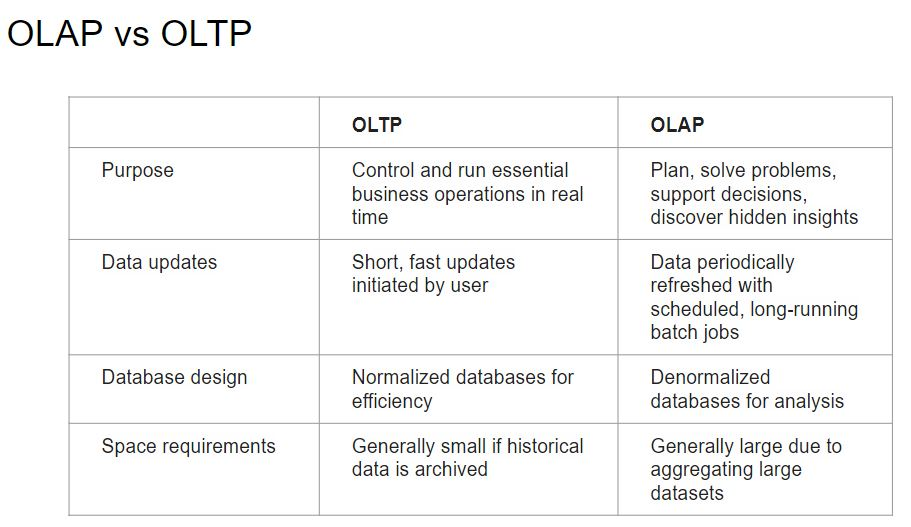
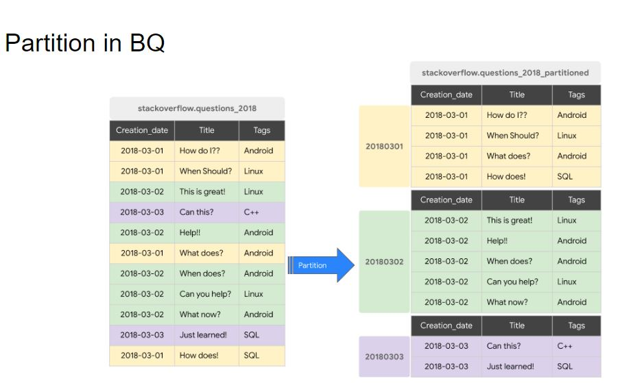
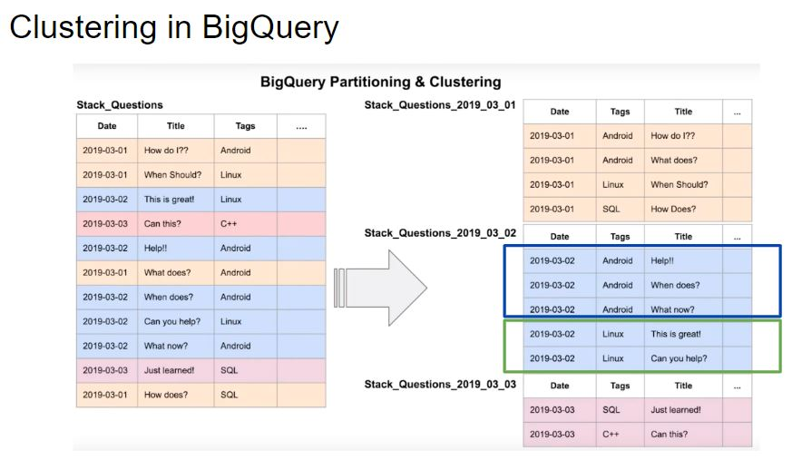
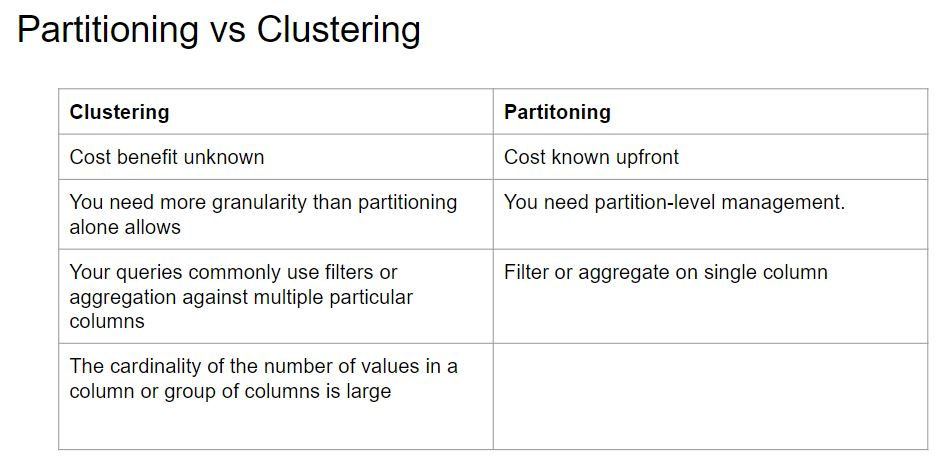
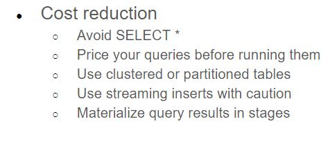
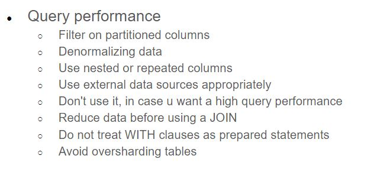
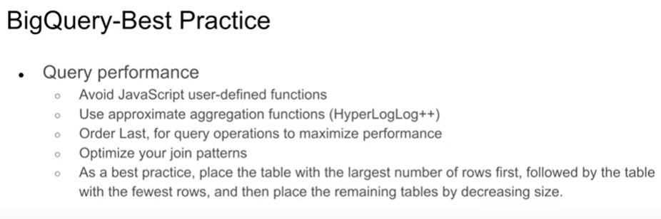
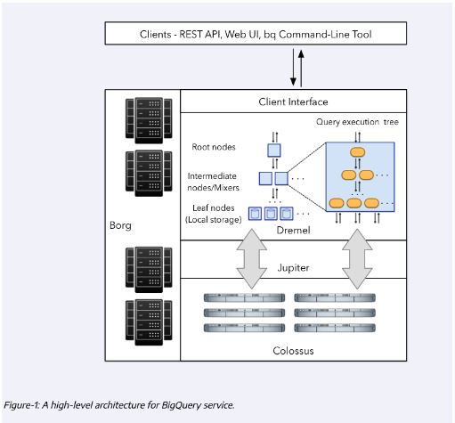
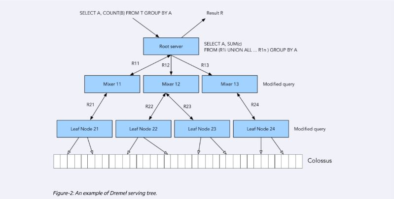
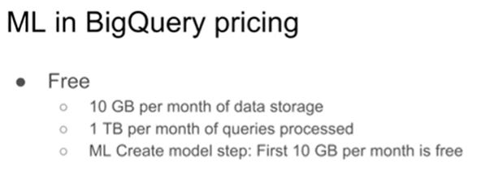

# Data Warehouse

# BigQuery

Severless Data Warehouse

https://cloud.google.com/bigquery/docs

## Partition in bq

## Clustering in bq

## Partition and Clustering

## BQ-Best Practice

## Internals of BigQuery

# Machine Learning in BigQuery

[How to deploy ml from bq using docker](https://www.youtube.com/watch?v=BjARzEWaznU&list=PL3MmuxUbc_hJed7dXYoJw8DoCuVHhGEQb&index=30)
