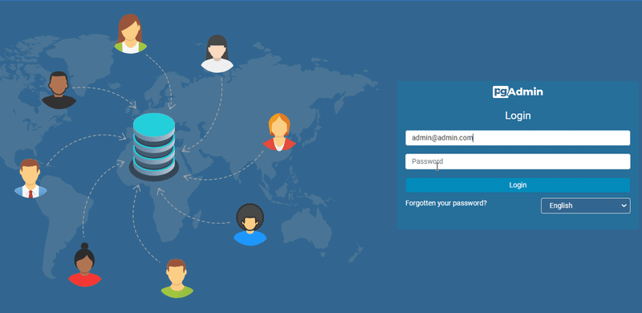
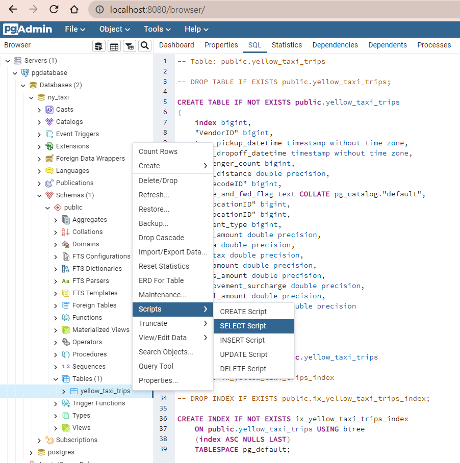
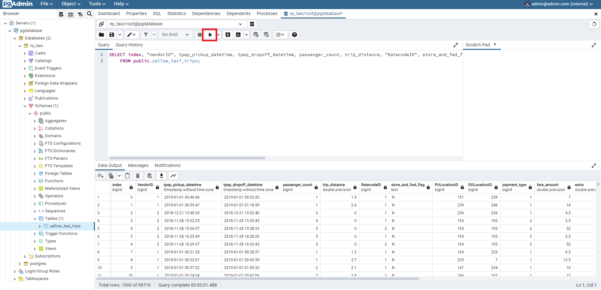

# How to run week2
prepare environment at root of this working directry
```bash
poetry install
```
# Table of contents

- [01_intro_to_prefect](#01_intro_to_prefect)
- [02_gcp](#02_gcp)

# 01_intro_to_prefect<a name="01_intro_to_prefect">
this working directry will extract data from github and upload to postgestql.

First, you need to run docker-compose.

visit `/week1/`

```bash
docker-compose up
```

then visit `/week2/`

```bash
poetry shell
```
```bash
python 01_intro_to_prefect/ingest_data.py
```

### Check the result at pgadmin4 

http://localhost:8080/

username : 
```
admin@admin.com
```

password : 
```
root
```



### create connection to postgesql

Hostname :
```
pgdatabase
```
Username & Password :
```
root
```


Then query to check the results.





# 02_gcp<a name="02_gcp">