# WEEK6 STREAM PROCESSING KAFKA

# What is stream processing

Exchange the data via someplace like notice board and cusomers who interested in that topic will get the message from producer.

Data exchange in stream processing

Actually, It is the same like notice board but it happen in computer and a bit more complicated.

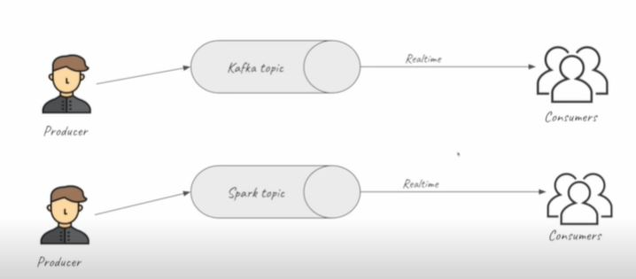

## What is Kafka
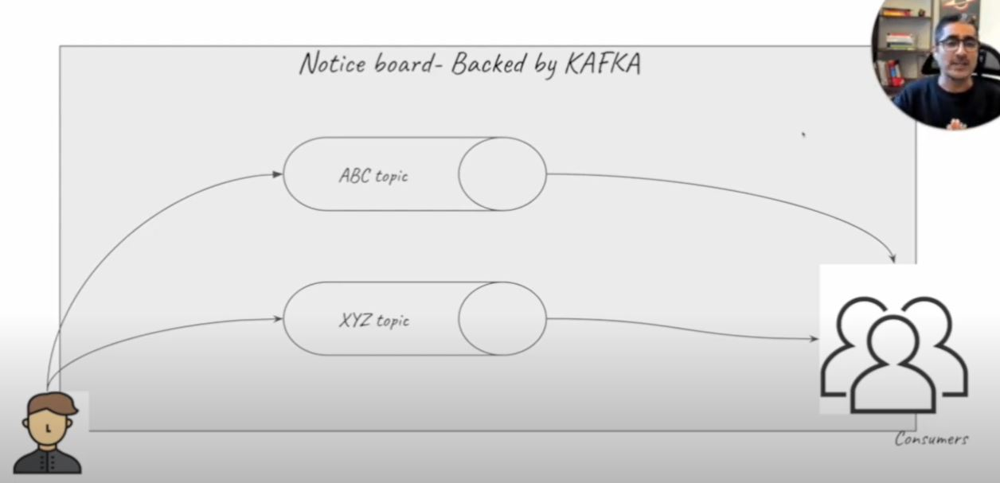

Producer - The one who create message or event

Consumer - The one who recieve message or event

What is a topic?

`collection of events`
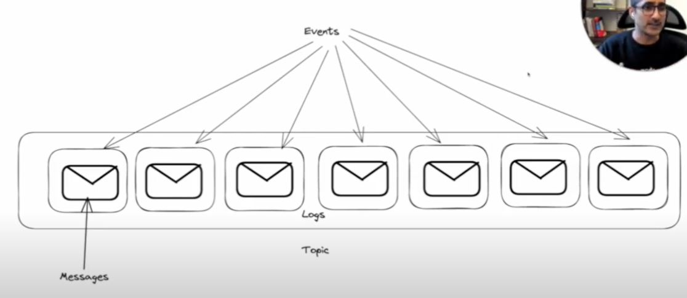

The topic contains the message from event along a time.

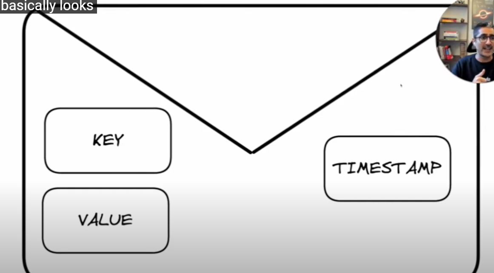

**Why Kafka ???**

### robustness or reliability

- even if your nodes are going down you will still ascess the data because kafka have replication so it replicates data.

### flexibility

- Topic can small or big
- You can have hundreds of consumers
- A lot of Integration

### Scalability

- Kafka can scale easily

# Kafka Configuration (important)

[more kafka configuration](https://kafka.apache.org/documentation/#configuration)
## Replication

If node 1 die then `data wasn't lost` because it replicate to another node.

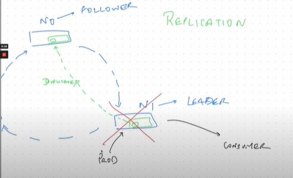

In picture when node 1(learder) was die then node 0 as a follower will be a new leader. producer and consumer will comunicate with note 0 instead.

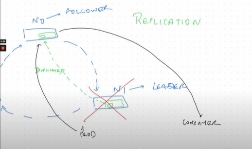

---

## Retention

Retention is `how long message need to keep` in topic each node.

Assume that we config retention for 1 day and the message's older then 1 day. It will get deleted automatically.

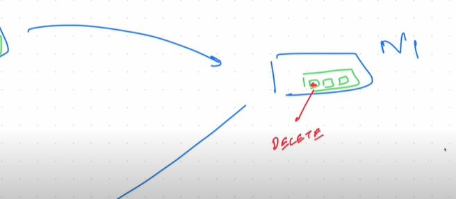

---

## Partitions

Partition allows kafka to `scale`

When we config partition to the topic (ex. partition = 2) then the data will separate to diffirent node.

So, when data is partitioning to another node. It's mean that cusomer can split up and talk to diffent nodes at the same time.

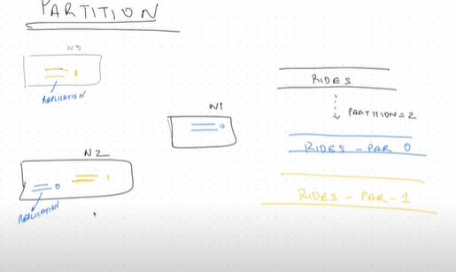

### example

### partition = 1
If we have 2 consumer consuming the message from kafka with no partition when 1 consumer comunicate with kafka's node another consumer need to wait for that node is avaliable.

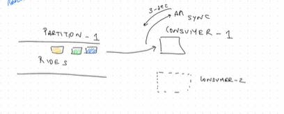

### partition = 2
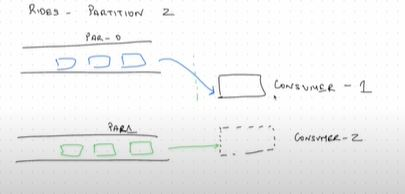

Now, consumer1 can consuming the half of message and consumer2 consuming another half. 

And How kafka know 2 consumer belong to the same topic?

It's `consumer group`.

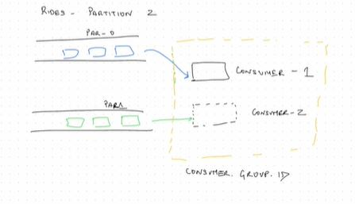

And What will happen if we have consumer-3?

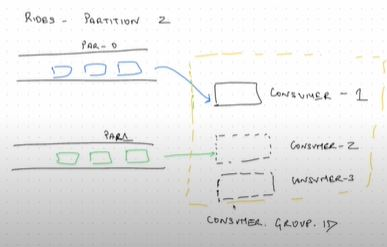

The answer is nothing happened. The number of partition have to equal to the number of cusomer. but it can help when consumer-2 die because something so then partition 1 will comunicate with consumer-3

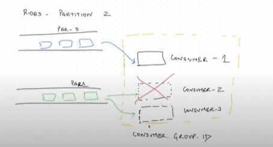

---

## Offset

How does a consumer know which particular message to consume from?

or 

How kafka know this consumer already consumed the message?

whenever consumer consumes from the topic it also acknowledges back to kafka "I have consumed this message".

consumer commit Kafka and Kafka store that information in another topic (--consumer-offset)

< consumer.group.id, topic, partition, offset >

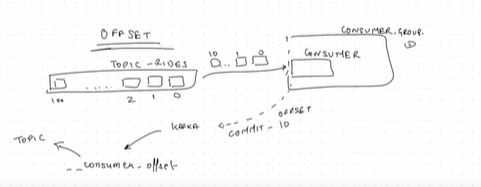

Then when consumer die and come back Kafka will know which message is already send to it or which message is already send to some of consumer of their consumer group id.

---

## AUTO.OFFSET.RESET

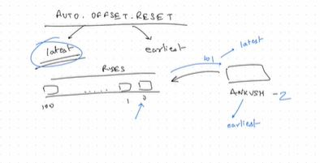

- lastest

when new consumer group id comunicate with kafka node it will consuming from lastest message.

In this example is 101

- earliest

when new consumer group id comunicate with kafka node it will consuming from earliest message.

In this example is 0

---

## ACK.ALL
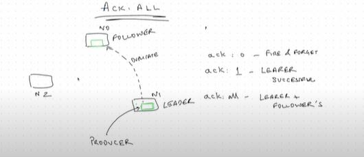
We have replication and when producer send some messages. it need to write or duplicated to seperate node sucessfully otherwise producer will have error and it has to resend the message.

Kafka has optional for this method.

ack : 0 - fire & forget ( fast )
- it doesn't care message will store successfully.

ex. count cpu load of server. It doesn't need to store old information.

ack : 1 - leader successful
- it wil wait the message write to leader successfully.

ack : all - leader + follower's ( a bit slower )
- it wil wait the message write to leader and follower successfully.

ex. rides data about payment. It's about financial statment. It can't miss any information then we will use acknowledge all.