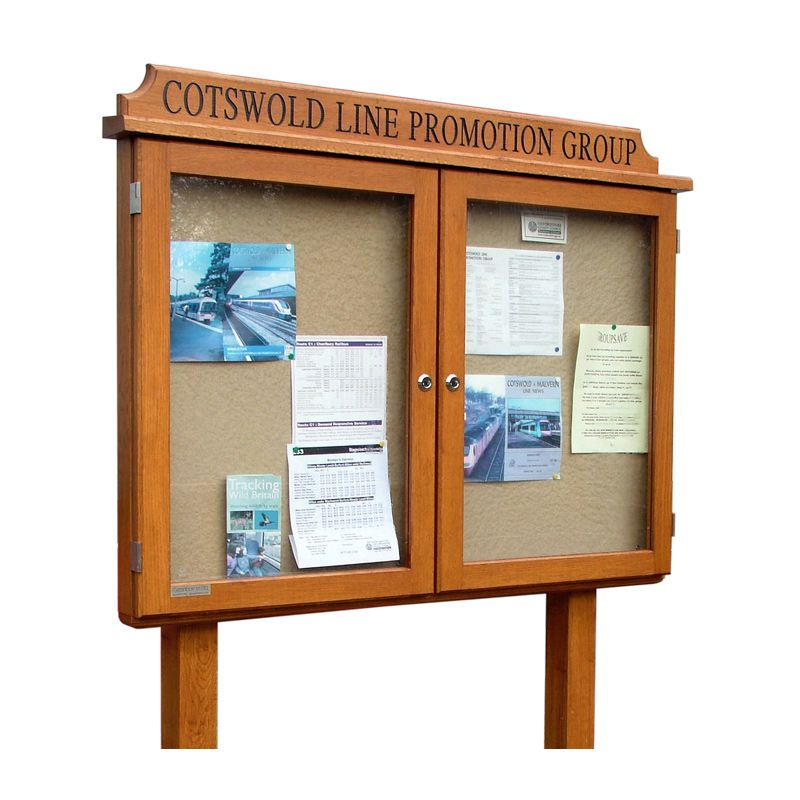

# WEEK6 STREAM PROCESSING KAFKA

## What is stream processing

Exchange the data via someplace like notice board and cusomers who interested in that topic will get the message from producer.

Data exchange in stream processing

Actually, It is the same like notice board but it happen in computer and a bit more complicated.

## What is Kafka

Producer - The one who create message or event

Consumer - The one who recieve message or event

What is a topic?

The topic contains the message from event along a time.

Componance of messages

**Why Kafka ???**

### robustness or reliability

- even if your nodes are going down you will still ascess the data because kafka have replication so it replicates data.

### flexibility

- Topic can small or big
- You can have hundreds of consumers
- A lot of Integration

### Scalability

- Kafka can scale with no limit

