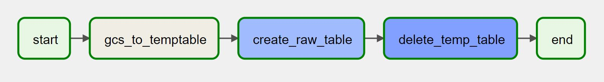
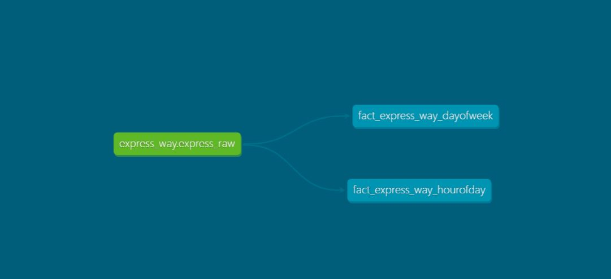
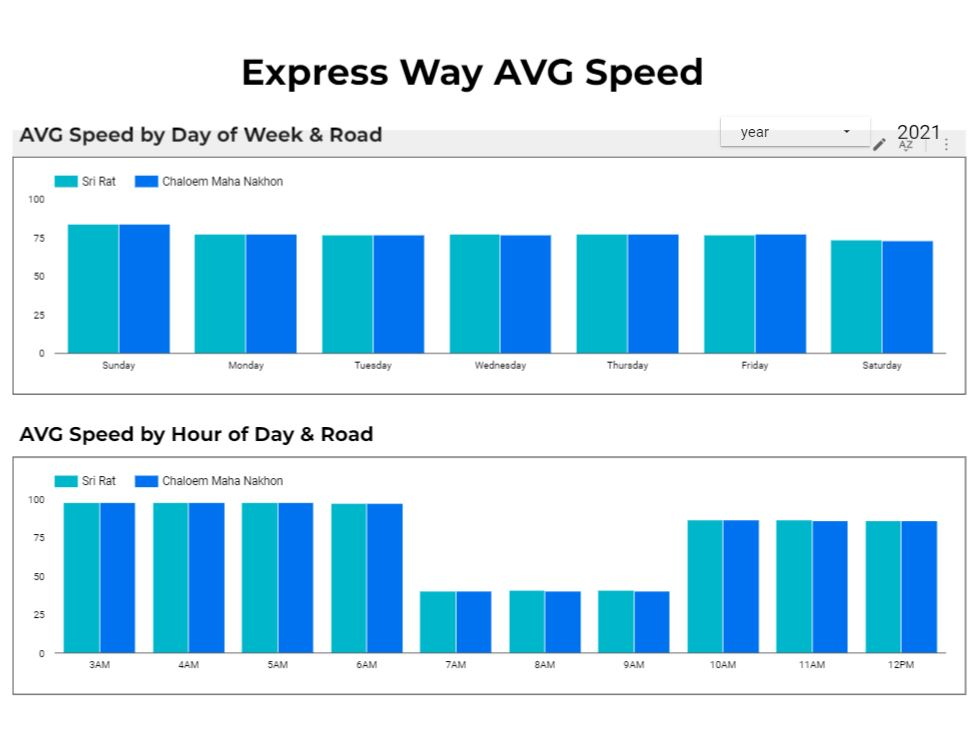

# Problem Description


The project aims to install sensors on an expressway to track the speed of cars every 60 seconds. The project solves two main problems:

Problem 1: Emergency teams need to know the real-time information on traffic conditions in congested areas of expressways in order to respond promptly to emergencies. Current approaches that rely on driver reports or manual traffic monitoring are ineffective and may cause delays in emergency response.

Problem 2: The marketing team wants to create a campaign that offers discounts to customers who use the expressway during non-peak hours. However, without data on when the expressway is congested, it is challenging to identify the optimal times to offer these discounts.

The project tracks the speed of cars using installed sensors every 60 seconds to provide real-time information on expressway traffic conditions. If the average speed on the road is low, this indicates a traffic jam. This data can be used by emergency teams to respond promptly to emergencies and by the marketing team to identify optimal times to offer discounts to customers. Therefore, the project effectively addresses both identified problems.

# Architecture


# initialize project
require
- google cloud account

## STEP1 : Terraform
[Terraform](https://github.com/Nattawatt/data-engineer-zoomcamp/tree/main/week_7_project/terraform)

## STEP2 : Kafka
[KAFKA](https://github.com/Nattawatt/data-engineer-zoomcamp/tree/main/week_7_project/kafka)

## STEP3 : Airflow
[AIRFLOW](https://github.com/Nattawatt/data-engineer-zoomcamp/blob/main/week_7_project/airflow)

## STEP4 : DBT
[DBT](https://github.com/Nattawatt/data-engineer-zoomcamp/tree/main/week_7_project/dbt)

# STREAMING 


## HOW TO RUN

STEP 1 :  Docker exec to interact with ksqldb-cli.
```bash
docker exec -it ksqldb-cli ksql http://ksqldb-server:8088
```

STEP 2 : Create `express_sensor_stream` stream.

```sql
CREATE STREAM express_sensor_stream(
  currenct_datetime TIMESTAMP,
  uid_txn VARCHAR,
  road_name VARCHAR,
  speed BIGINT
) WITH (
  KAFKA_TOPIC='express_sensor',
  VALUE_FORMAT='JSON_SR',
  TIMESTAMP='currenct_datetime'
);
```
STEP 3 : Create `express_report_5_mins` table.
```sql
CREATE TABLE express_report_5_mins
AS
SELECT 
 road_name, 
 AVG(speed) AS AVG_SPEED_5_MIN
FROM 
express_sensor_stream WINDOW TUMBLING (SIZE 5 MINUTE) 
GROUP BY road_name;
```

STEP 3 : Watch table
```sql
SELECT
    road_name,
    WINDOWSTART,
    WINDOWEND,
    FROM_UNIXTIME(WINDOWSTART) AS window_start_utc_plus_7,
    FROM_UNIXTIME(WINDOWEND) AS window_end_utc_plus_7,
    AVG_SPEED_5_MIN,
    CASE
      WHEN AVG_SPEED_5_MIN > 100 THEN 'flow'
      WHEN AVG_SPEED_5_MIN > 60 THEN 'normal'
      ELSE 'jam' END AS TRAFFIC_STATUS
FROM express_report_5_mins EMIT CHANGES;
```
## VIDEO

https://www.loom.com/share/3077c4c5cffc4c8098e7981c5f8046a4

# BATCH
I create pipeline for fullload from event data. 

Actually, I'd desiged pipeline for incremental load but at kafka connector they provide prefix only datetime that processing in connector cluster. 

It will have only prefix for today ex. yyyy=2022/mm=05/dd=31 not timestamp in an event.


## VIDEO

https://www.loom.com/share/47d78f5144724c1c927230c0fee20a60

# Data warehousing
I create a partition and clustering table in Bigquery

For downstream usage
- It can query to point of time in DWH in optimise way.
- For downstream query it need to aggregration for unit of analyst is raod_name.

```python
'clustering': {
                "fields" : [
                    "road_name"
                    ]
                },
            'timePartitioning' : {
                "type": "DAY",
                "field": "currenct_datetime"
                }
```

# Transformations
I use dbt for transformations from date transaction to avg per day and hours per road_name



## VIDEO

https://www.loom.com/share/ae9f3ae8b54f46a3be514c729e7e3c25

# Dashboard



https://lookerstudio.google.com/reporting/db044a7e-8235-4500-b5ee-7921a9b5340e

-----
# peer-review-criteria

* Problem description
    * 0 points: Problem is not described
    * 1 point: Problem is described but shortly or not clearly 
    * 2 points: Problem is well described and it's clear what the problem the project solves
* Cloud
    * 0 points: Cloud is not used, things run only locally
    * 2 points: The project is developed in the cloud
    * 4 points: The project is developed in the cloud and IaC tools are used
* Data ingestion (choose either batch or stream)
    * Batch / Workflow orchestration
        * 0 points: No workflow orchestration
        * 2 points: Partial workflow orchestration: some steps are orchestrated, some run manually
        * 4 points: End-to-end pipeline: multiple steps in the DAG, uploading data to data lake
    * Stream
        * 0 points: No streaming system (like Kafka, Pulsar, etc)
        * 2 points: A simple pipeline with one consumer and one producer
        * 4 points: Using consumer/producers and streaming technologies (like Kafka streaming, Spark streaming, Flink, etc)
* Data warehouse
    * 0 points: No DWH is used
    * 2 points: Tables are created in DWH, but not optimized
    * 4 points: Tables are partitioned and clustered in a way that makes sense for the upstream queries (with explanation)
* Transformations (dbt, spark, etc)
    * 0 points: No tranformations
    * 2 points: Simple SQL transformation (no dbt or similar tools)
    * 4 points: Tranformations are defined with dbt, Spark or similar technologies
* Dashboard
    * 0 points: No dashboard
    * 2 points: A dashboard with 1 tile
    * 4 points: A dashboard with 2 tiles
* Reproducibility
    * 0 points: No instructions how to run code at all
    * 2 points: Some instructions are there, but they are not complete
    * 4 points: Instructions are clear, it's easy to run the code, and the code works