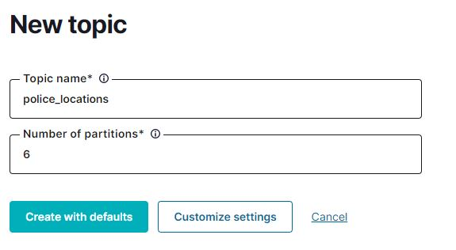

# RUN DOCKER-COMPOSE

```
poetry install
```

At `infra/`

```
docker-compose up -d
```
# check docker container up all( TODO )

# CREATE TOPICS
```
topics = police_locations
partition = 6
```
## UI ( OPTION 1 )
visit `http://localhost:9021/`



## CLI ( OPTION 2 )( TODO )
```
docker exec -it ksqldb-cli ksql http://ksqldb-server:8088
```
# CREATE STREAMING

## UI ( OPTION 1 )
```
```
## CLI ( OPTION 2 )( TODO )
```
docker exec -it ksqldb-cli ksql http://ksqldb-server:8088
```

```
CREATE STREAM police_locations_stream (
  uid DOUBLE,
  timestamp VARCHAR(string),
  first_name VARCHAR(string),
  last_name VARCHAR(string),
  age DOUBLE,
  age_in_police_job DOUBLE,
  rank VARCHAR(string),
  lat DOUBLE,
  long DOUBLE,
  sub_district VARCHAR(string),
  district VARCHAR(string),
  state VARCHAR(string)
) WITH (
  KAFKA_TOPIC='police_locations',
  VALUE_FORMAT='JSON_SR'
);
```

```
SHOW STREAMS;
```

```
SELECT * FROM POLICE_LOCATIONS_STREAM EMIT CHANGES;
```
# RUN PRODUCER
```bash
poetry shell
```

at `./kafka`
```bash
python producer_police_locations.py
```


# REF
ksql-getstart - ( https://ksqldb.io/quickstart.html )

ksql-python - ( https://github.com/bryanyang0528/ksql-python )