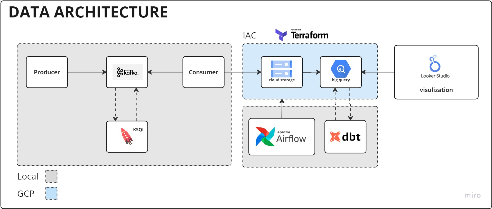

# Problem Description

The project aims to install sensors on an expressway to track the speed of cars every 60 seconds. The project solves two main problems:

Problem 1: Emergency teams need to know the real-time location of the expressway's congested areas to take immediate action. The current approach of relying on driver reports or manually monitoring traffic conditions is not effective and can cause delays in emergency response times.

Problem 2: The marketing team wants to create a campaign that offers discounts to customers who use the expressway during non-peak hours. However, without data on when the expressway is congested, it is challenging to identify the optimal times to offer these discounts.

By tracking the speed of cars every 60 seconds using the installed sensors, the project provides real-time information on the expressway's traffic conditions. This data can be used by the emergency teams to take immediate action, and the marketing team can identify the optimal times to offer discounts to customers. Thus, the project effectively addresses both the identified problems.

# Architecture

# initialize project
requirement
1.google cloud account

## step1 cloud
[CLOUD](https://github.com/Nattawatt/data-engineer-zoomcamp/tree/main/week_7_project/terraform)

## step2 kafka
[KAFKA](https://github.com/Nattawatt/data-engineer-zoomcamp/tree/main/week_7_project/kafka)

## step3 airflow
[AIRFLOW](https://github.com/Nattawatt/data-engineer-zoomcamp/blob/main/week_7_project/airflow)

## step4 dbt
[DBT](https://github.com/Nattawatt/data-engineer-zoomcamp/tree/main/week_7_project/dbt)

# STREAMING VIDEO

<iframe src="https://www.loom.com/embed/49418fe8ca6c47af9f627baff0bf9e21" frameborder="0" webkitallowfullscreen mozallowfullscreen allowfullscreen style="position: absolute; top: 0; left: 0; width: 100%; height: 100%;"></iframe>

-----
# peer-review-criteria

* Problem description
    * 0 points: Problem is not described
    * 1 point: Problem is described but shortly or not clearly 
    * 2 points: Problem is well described and it's clear what the problem the project solves
* Cloud
    * 0 points: Cloud is not used, things run only locally
    * 2 points: The project is developed in the cloud
    * 4 points: The project is developed in the cloud and IaC tools are used
* Data ingestion (choose either batch or stream)
    * Batch / Workflow orchestration
        * 0 points: No workflow orchestration
        * 2 points: Partial workflow orchestration: some steps are orchestrated, some run manually
        * 4 points: End-to-end pipeline: multiple steps in the DAG, uploading data to data lake
    * Stream
        * 0 points: No streaming system (like Kafka, Pulsar, etc)
        * 2 points: A simple pipeline with one consumer and one producer
        * 4 points: Using consumer/producers and streaming technologies (like Kafka streaming, Spark streaming, Flink, etc)
* Data warehouse
    * 0 points: No DWH is used
    * 2 points: Tables are created in DWH, but not optimized
    * 4 points: Tables are partitioned and clustered in a way that makes sense for the upstream queries (with explanation)
* Transformations (dbt, spark, etc)
    * 0 points: No tranformations
    * 2 points: Simple SQL transformation (no dbt or similar tools)
    * 4 points: Tranformations are defined with dbt, Spark or similar technologies
* Dashboard
    * 0 points: No dashboard
    * 2 points: A dashboard with 1 tile
    * 4 points: A dashboard with 2 tiles
* Reproducibility
    * 0 points: No instructions how to run code at all
    * 2 points: Some instructions are there, but they are not complete
    * 4 points: Instructions are clear, it's easy to run the code, and the code works