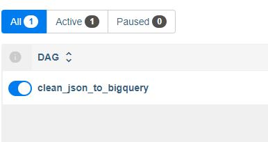

# How to start airflow
```bash
export PROJECT_ID=<YOUR_PROJECT_ID>
export GCS_BUCKET_EXPRESS=<GCS_BUCKET_EXPRESS>
```

```bash
./setup.sh
```

```
docker compose build airflow-init
```

```
docker compose up -d
```

# START DAGS

visit ( http://localhost:8080/home )



# REF
create-new-connection - ( https://cloud.google.com/composer/docs/how-to/managing/connections#creating_new_airflow_connections )