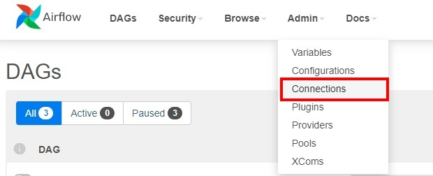

# How to start airflow
```
echo -e "AIRFLOW_UID=$(id -u)" > .env
```

```
docker compose up airflow-init
```

```
docker compose up
```

## Manage connection at **Airflow UI**
You can manage connection here

