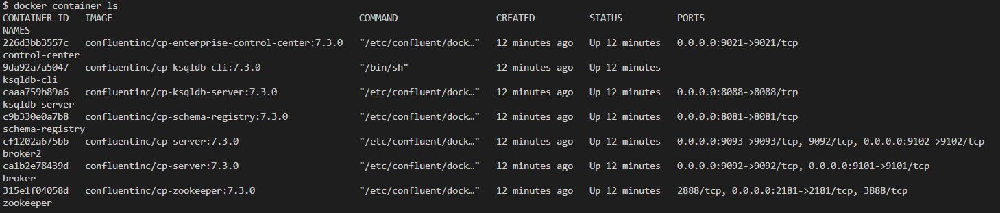

# RUN DOCKER-COMPOSE
At `kafka/`

```
docker-compose up -d
```

**check docker container up all**
```bash
docker container ls
```


# RUN PRODUCER
```bash
poetry install
```

```bash
poetry shell
```

at `./kafka/src`

```bash
python producer.py --road_name <road_name> ## any name
```

example
```bash
python producer.py --road_name "Chaloem Maha Nakhon"
python producer.py --road_name "Sri Rat"
```

# Clean resources
```bash
docker-compose down -v --remove-orphans
```

# REF

ksql-getstart - ( https://ksqldb.io/quickstart.html )

kafka-connect - ( https://www.confluent.io/blog/kafka-connect-deep-dive-converters-serialization-explained/#non-json-data-jsonconverter )

kafka-sink-gcs - ( https://www.entechlog.com/blog/kafka/how-to-stream-data-from-kafka-to-gcs/ )